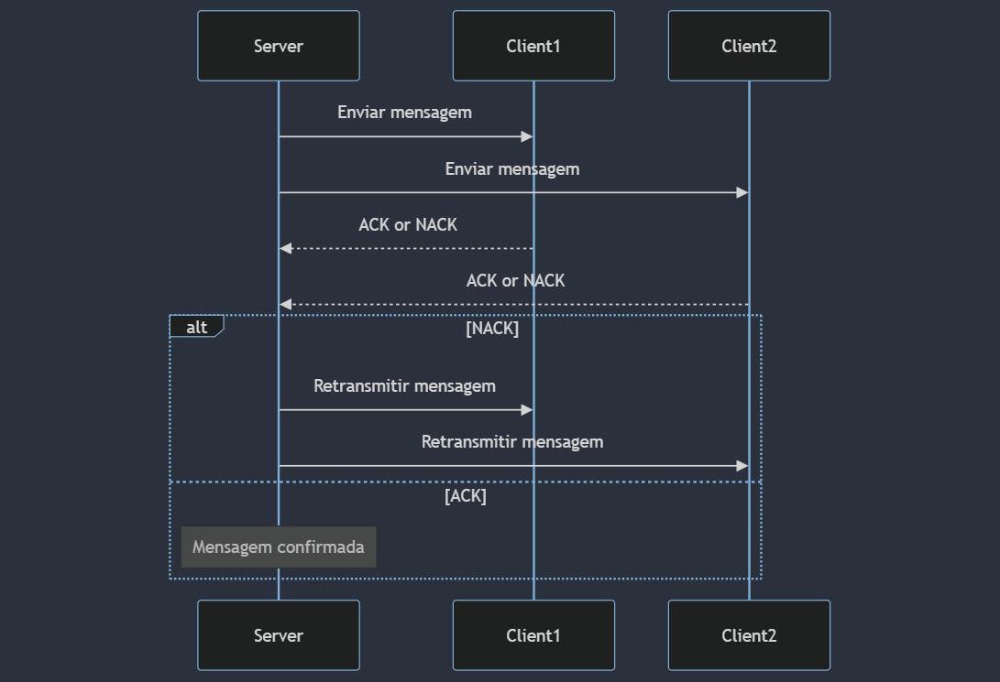
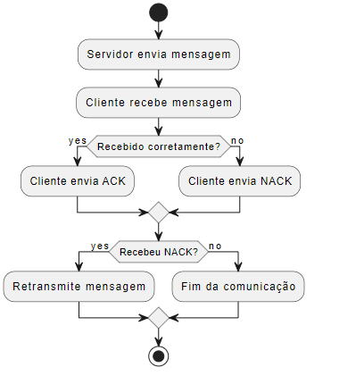

# Relatório Técnico: Sistema de Difusão Confiável com ACK e NACK
###  **Abordagem Escolhida**
A abordagem adotada para o sistema de difusão confiável envolve o uso de confirmações positivas **(ACK)** e negativas **(NACK)** para garantir a entrega correta das mensagens em um ambiente de rede distribuída. Escolhemos esta técnica porque:

**Robustez:** Permite a detecção e correção de erros de forma eficiente, garantindo alta confiabilidade na comunicação entre os nós.

**Simplicidade:** Utiliza conceitos bem estabelecidos de comunicação em rede, facilitando a implementação e a depuração.

**Eficiência em Redes com Condições Variáveis:** Efetivamente lida com variações na qualidade da rede, como perda de pacotes e latência.
Arquitetura do Sistema
O sistema é composto por um servidor (emissor) e múltiplos clientes (receptores). A arquitetura é dividida em várias partes:

Servidor (Emissor):

- Estabelece conexões com todos os clientes esperados.
- Mantém um buffer de histórico de todas as mensagens enviadas.
- Envia mensagens para todos os clientes conectados.
Recebe ACK ou NACK de cada cliente e retransmite as mensagens quando necessário.

Cliente (Receptor):

- Conecta-se ao servidor.
- Recebe mensagens.
- Simula a recepção bem-sucedida ou falha da mensagem (perda de mensagem).
- Envia ACK se a mensagem for recebida corretamente ou NACK se a mensagem for perdida.

### Diagrama do Sistema




### Pseudocódigo do Algoritmo de Detecção e Correção de Erros

```markdown
# Algoritmo Servidor:
1. Iniciar servidor em uma porta específica
2. Esperar por conexões de todos os clientes esperados
3. Para cada mensagem a ser enviada:
   a. Armazenar mensagem no buffer de histórico
   b. Enviar mensagem para todos os clientes
   c. Para cada cliente:
      i. Esperar por um ACK ou NACK
      ii. Se NACK recebido:
         - Retransmitir todas as mensagens do buffer para o cliente
4. Fechar conexões após a comunicação

# Algoritmo Cliente:
1. Conectar ao servidor
2. Receber mensagem
3. Simular aleatoriamente sucesso ou falha na recepção da mensagem
   a. Se falha:
      - Enviar NACK
   b. Se sucesso:
      - Enviar ACK
4. Desconectar do servidor após a comunicação
```

Fluxograma do Algoritmo de Detecção e Correção de Erros



### Considerações Finais
A implementação do sistema de difusão confiável com ACK e NACK é uma solução robusta para garantir a confiabilidade em redes distribuídas. A estratégia de manter um buffer de histórico e retransmitir mensagens permite uma recuperação eficaz de mensagens perdidas, adequando-se a cenários onde a integridade da mensagem é crítica. A arquitetura e algoritmos podem ser ajustados ou expandidos para acomodar requisitos específicos ou melhorar a eficiência e escalabilidade do sistema.