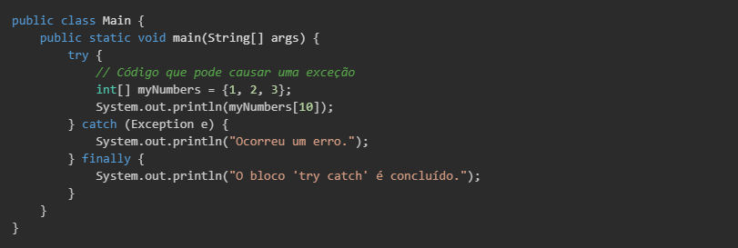

# "Tratamento de Exceções em Java e Python: Uma Análise Comparativa"
author: "Roger da Palma" rogerdapalma@gmail.com

## Abstract
O manejo de exceções é uma parte essencial para garantir que programas se comportem de maneira previsível mesmo quando encontram erros. Java e Python, duas linguagens populares, utilizam estratégias parecidas para tratar exceções, embora cada uma apresente suas próprias peculiaridades na sintaxe. Isso permite que os programas continuem rodando suavemente, mesmo diante de problemas durante a execução.

## Introdução
O tratamento de exceções é essencial para a construção de programas robustos. Este documento explora como Java e Python abordam o tratamento de exceções, destacando suas características principais e diferenças.

## Tratamento de Exceções em Java
### Conceitos Principais:
- Exceção: Evento que ocorre durante a execução de um programa e que interrompe o fluxo normal de instruções.
- Try-Catch: Bloco try é usado para encapsular o código que pode lançar uma exceção, enquanto o bloco catch é usado para tratar a exceção.

### Boas Práticas:
- Tratar exceções específicas sempre que possível, em vez de usar uma abordagem genérica.
- Utilizar o bloco finally para liberar recursos, como fechar conexões de arquivos ou de banco de dados, independente de uma exceção ser lançada ou não.
- Evitar o uso excessivo de exceções como controle de fluxo lógico.

*Conceitos Básicos em Java*

*Conceitos Basicos aplicados em um codigo*

## Tratamento de Exceções em Python
### Conceitos Principais:
- Exceção: Interrupções que ocorrem durante a execução que são captadas pelo interpretador.
- Try-Except: Bloco try é usado para monitorar uma exceção que pode ocorrer e except é usado para capturar a exceção que ocorreu.

### Boas Práticas:
- Capturar exceções específicas ao invés de uma captura genérica, o que ajuda a tratar o erro de maneira mais adequada.
- Utilizar finally para garantir que recursos sejam liberados, como arquivos e conexões de rede, mesmo que uma exceção seja lançada.
- Utilizar else no bloco try para executar código que deve correr apenas se o bloco try não lançar nenhuma exceção.

- Conceitos Básicos em Python*

- *Conceitos Basicos aplicados em um codigo*

# Comparação entre Java e Python
Sintaxe e Palavras-chave: Ambas as linguagens usam uma estrutura similar com try e finally. A principal diferença está no uso de catch (Java) versus except (Python). Além disso, em Python, a exceção é geralmente referenciada como e usando a palavra as, enquanto em Java usa-se e diretamente.

Tipos de Exceções: Java é uma linguagem de tipagem estática e exige que o tipo de exceções capturadas seja explicitamente declarado. Python, sendo dinâmico, permite uma maior flexibilidade na captura de exceções sem necessariamente declarar seus tipos.

Controle de Fluxo: Em ambos os sistemas, o controle de fluxo é desviado para o bloco de captura assim que uma exceção é lançada, e o bloco finally é executado ao final do processo para garantir que os recursos sejam liberados adequadamente.

Práticas Recomendadas: Em ambas as linguagens, é considerada uma boa prática utilizar exceções para lidar com condições excepcionais e não como parte do fluxo normal de um programa. Além disso, é recomendável sempre limpar os recursos em um bloco finally ou usando gerenciadores de contexto em Python (with).

# Conclusão
Ambas as linguagens fornecem mecanismos robustos para o tratamento de exceções, visando garantir que os programas possam lidar com condições de erro sem interromper abruptamente a execução. A sintaxe e as práticas recomendadas ajudam os desenvolvedores a escrever código mais seguro e fácil de manter.

# Referencias
- Oracle. "The Java Tutorials", [Java Tutorial](https://docs.oracle.com/javase/tutorial/essential/exceptions/catch.html).
- DevMedia. "Blocos try-catch", [Java Documentation](https://www.devmedia.com.br/blocos-try-catch/7339).
- W3Schools. "Java Try and Catch", [Java Practices](https://www.w3schools.com/java/java_try_catch.asp).
- Python Documentation. "Errors and Exceptions", [Python Documentation](https://docs.python.org/3/tutorial/errors.html).
- Stack Overflow. "Qual a função do try e do except", [Python Practices](https://pt.stackoverflow.com/questions/316516/qual-a-função-do-try-e-do-except).
